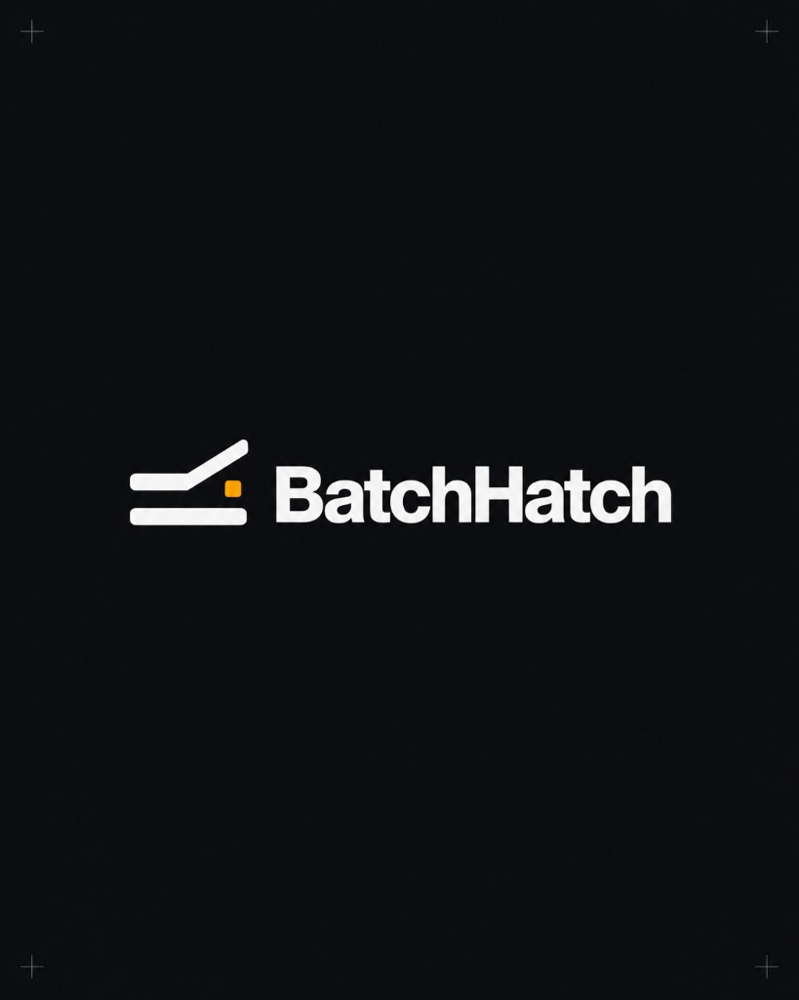

# BatchHatch

**Hack the Hill III · CGI Challenge — Northwind Utilities · Barrowdale & Dunmoor billing correction**

> Fix overbilled accounts while the customer is still on the phone.  
> Aurora's 1998 COBOL rating engine, running in the browser in 15ms.



---

## The problem

Northwind has 519,000 accounts across Barrowdale and Dunmoor with zero smart-meter penetration. Aurora SYS-06 (2012) fills the gap with seasonal estimates calibrated on 2010–2012 national averages — never updated since. At 62% estimated-read rate, it generates **13,147 billing exceptions per month**.

The complaints, callbacks, and escalations all follow from that number. The average resolution time is now **38.2 days**, down from 9.1 days two years ago. The AI chatbot Northwind deployed in Jan 2025 made it worse — 82.6% of sessions escalate to a human agent anyway.

BatchHatch doesn't triage complaints. It fixes the bill during the call.

---

## How it works

1. Agent pulls up the customer's account
2. Customer reads the number off their physical dial meter
3. BatchHatch runs it through the same COBOL rating logic as the overnight mainframe job
4. Corrected bill is issued in 15ms — no waiting for the 2am batch
5. An 80-column SYS-01 batch record is generated, ready for ingest

The engine validates the reading against the previous read, checks plausibility against the account's typical quarterly usage, and rejects anything that would produce an impossible result before it touches the batch file.

---

## Value case (Year 1, conservative)

| | |
|---|---|
| Callback elimination | $316k |
| Manual correction elimination | $300k |
| Complaint deflection | $245k |
| **Total Year 1 savings** | **$861k** |
| Implementation cost | $65k |
| **Payback** | **4 weeks** |

Full model at `/metrics` in the running app, sourced from Northwind's own CSV data.

---

## Stack

- **Next.js 16** (App Router, Turbopack)
- **TypeScript**
- **Tailwind v4** (CSS-based config)
- **Satoshi** (UI font via Fontshare) + **Geist Mono** (code/terminal)
- COBOL engine simulated in TypeScript — faithful translation of Aurora SYS-01 `RATING.COB` v4.2.1 (1998) logic, compiled to match mainframe output format exactly

---

## Running locally

```bash
npm install
npm run dev
```

Open [http://localhost:3000](http://localhost:3000).

For the demo, load **Margaret Holloway (DUN-9021)** and enter dial read **61,400**.

---

## Data

All data from the official Northwind challenge package:

- `northwind_unit_costs.csv`
- `northwind_systems.csv`
- `northwind_monthly_kpis.csv`
- `northwind_meter_reads.csv`
- `northwind_ai_pilot_2025.csv`

---

## Team

| Name | |
|---|---|
| Omar Ismail | |
| Moaz Sholook | |
| Iman Ullah | |

Hack the Hill III · CGI Challenge · Sep 2026
